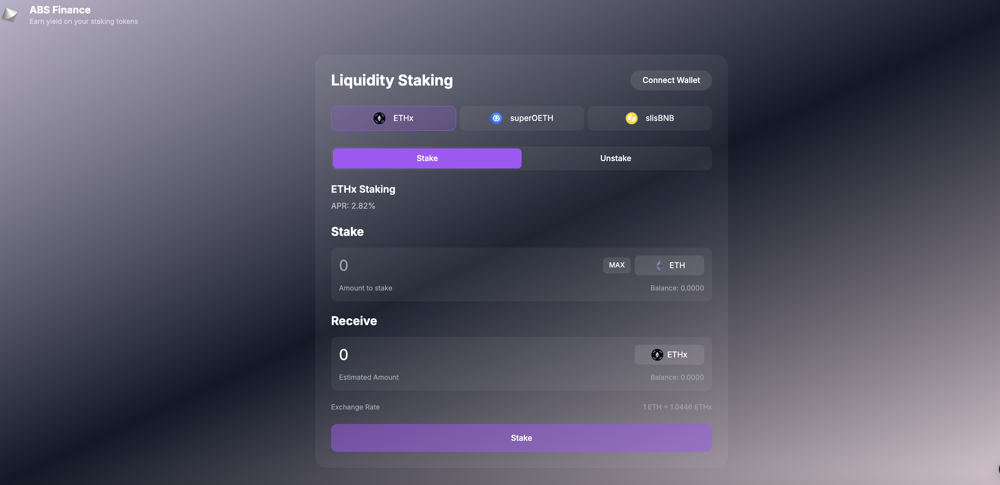

# ABS Finance - Cross-Chain Staking Platform

## Project Overview

ABS Finance is a multi-chain staking platform built during the Particle Network Hackathon that showcases seamless DeFi interactions through Particle Connect integration. By leveraging Particle Network's powerful authentication SDK, we've created a user-friendly staking experience that simplifies cross-chain interactions.

## Problem Statement

The current DeFi landscape presents significant barriers to entry:

- Complex wallet management and connection processes
- Confusing onboarding experience for new users
- Need for multiple wallets across different chains
- Manual network switching between chains
- Complex transaction signing processes

## Our Solution

ABS Finance revolutionizes the multi-chain staking experience through Particle Connect:

- One-click social login (Google, Twitter, Discord, etc.)
- Seamless wallet connection across multiple chains
- Unified interface for cross-chain staking
- Simplified transaction signing
- Automated network switching

## Particle Connect Integration

Our platform leverages Particle Connect's powerful features:

- Social login integration with multiple providers
- Unified wallet connection interface
- Future-ready for Universal Accounts
- Seamless cross-chain transaction handling
- Enhanced security through Particle's infrastructure

## Demo

[Live Demo Link](https://abs-finance.vercel.app/)

### Video Demonstration

[Watch Demo Video](https://youtu.be/u4cZ0Iq3780)

### Screenshots



## Technical Architecture

### Frontend Stack

- Next.js 14 with TypeScript
- TailwindCSS for styling
- Particle Network SDKs
- Auth Core
- Account Abstraction
- ethers.js for blockchain interactions

Smart Contract Integration
We integrate with three major staking protocols:

1. **Stader Protocol (Ethereum Holesky)**

```32:54:src/app/components/staking/StaderStaking.tsx
        StaderABI,
        signer
      );
      const tx = await erc20.deposit(address, {
        value: amountInWei,
      });
      const receipt = await tx.wait();
      setTxHash(
        `Staking successful, transaction hash:: ${receipt.transactionHash}`
      );
      return receipt.transactionHash;
    } catch (error) {
      throw new Error(`Staking failed: ${error}`);
    }
  };
  const checkAllowance = async (amount: string): Promise<boolean> => {
    try {
      const StaderWithdrawContractAddress =
        "0x7F09ceb3874F5E35Cd2135F56fd4329b88c5d119";
      const tokenContractAddress = "0xB4F5fc289a778B80392b86fa70A7111E5bE0F859";
      const address = await smartAccount.getAddress();

      const tokenContract = new ethers.Contract(
```

2. **Origin Protocol (Base)**

```260:266:src/app/components/StakingPage.tsx
  const superOETHStaking = useSuperOETHStaking({
    provider,
    smartAccount,
    customProvider,
    amount,
    setTxHash,
  });
```

3. **Lista Finance (BNB Chain)**

```267:273:src/app/components/StakingPage.tsx
  const listaStaking = useListaStaking({
    provider,
    smartAccount,
    customProvider,
    amount,
    setTxHash: setTxResult,
  });
```

### Account Abstraction Implementation

The platform leverages Particle Network connect SDK for account abstraction.

```
  useEffect(() => {
    if (provider) {
      const newSmartAccount = new SmartAccount(provider, {
        projectId: process.env.NEXT_PUBLIC_PROJECT_ID!,
        clientKey: process.env.NEXT_PUBLIC_CLIENT_KEY!,
        appId: process.env.NEXT_PUBLIC_APP_ID!,
        aaOptions: {
          accountContracts: {
            SIMPLE: [
              {
                chainIds: [getChainId()],
                version: "1.0.0",
              },
            ],
          },
        },
      });
      const newCustomProvider = new Web3Provider(
        new AAWrapProvider(newSmartAccount, SendTransactionMode.Gasless),
        "any"
      );
      setSmartAccount(newSmartAccount);
      setCustomProvider(newCustomProvider);
    }
  }, [provider, selectedToken, getChainId]);
```

### Key Features

1. **Multi-Chain Support**

```346:388:src/app/components/StakingPage.tsx
  // 체인 설정 가져오기 함수
  const getTargetChainConfig = (tokenId: string) => {
    switch (tokenId) {
      case "ETHx":
        return {
          chainId: `0x${EthereumHolesky.id.toString(16)}`,
          chainName: "Ethereum Holesky",
          rpcUrls: [EthereumHolesky.rpcUrl],
          nativeCurrency: {
            name: EthereumHolesky.nativeCurrency.name,
            symbol: EthereumHolesky.nativeCurrency.symbol,
            decimals: EthereumHolesky.nativeCurrency.decimals,
          },
          blockExplorerUrls: [EthereumHolesky.blockExplorerUrl],
        };
      case "superOETH":
        return {
          chainId: `0x${Base.id.toString(16)}`,
          chainName: "Base",
          rpcUrls: [Base.rpcUrl],
          nativeCurrency: {
            name: Base.nativeCurrency.name,
            symbol: Base.nativeCurrency.symbol,
            decimals: Base.nativeCurrency.decimals,
          },
          blockExplorerUrls: [Base.blockExplorerUrl],
        };
      case "slisBNB":
        return {
          chainId: `0x${BNBChain.id.toString(16)}`,
          chainName: "BNB Chain",
          rpcUrls: [BNBChain.rpcUrl],
          nativeCurrency: {
            name: BNBChain.nativeCurrency.name,
            symbol: BNBChain.nativeCurrency.symbol,
            decimals: BNBChain.nativeCurrency.decimals,
          },
          blockExplorerUrls: [BNBChain.blockExplorerUrl],
        };
      default:
        return getTargetChainConfig("ETHx");
    }
  };
```

2. **Social Login Integration**

```20:51:src/app/layout.tsx
        <AuthCoreContextProvider
          options={{
            // All env variable must be defined at runtime
            projectId: process.env.NEXT_PUBLIC_PROJECT_ID!,
            clientKey: process.env.NEXT_PUBLIC_CLIENT_KEY!,
            appId: process.env.NEXT_PUBLIC_APP_ID!,

            // This is how you limit the options available.
            // Remove the authTypes array to display all options available
            authTypes: [
              AuthType.email,
              AuthType.google,
              AuthType.twitter,
              AuthType.github,
              AuthType.discord,
            ],
            themeType: "dark",
            fiatCoin: "USD",
            language: "en",
            erc4337: {
              name: "SIMPLE",
              version: "1.0.0",
            },
            wallet: {
              // Set to false to remove the embedded wallet modal
              visible: true,
              customStyle: {
                // Locks the chain selector to Base Sepolia and EthereumHolesky
                supportChains: [BNBChain, EthereumHolesky, Base],
              },
            },
          }}
```

3. **Real-time APY Tracking**

```110:155:src/app/components/StakingPage.tsx
  const fetchStaderAPR = useCallback(async () => {
    try {
      const response = await fetch("https://universe.staderlabs.com/eth/apy");
      const data = await response.json();

      return data.value + "%";
    } catch (error) {
      console.error("Failed to fetch Stader APR:", error);

      return "0%";
    }
  }, []);

  const fetchSuperOETHAPY = useCallback(async () => {
    try {
      const response = await fetch(
        "https://origin.squids.live/origin-squid:prod/api/graphql",
        {
          method: "POST",
          headers: { "Content-Type": "application/json" },
          body: JSON.stringify({
            query: `
              query OTokenApy($chainId: Int!, $token: String!) {
                oTokenApies(
                  limit: 1
                  orderBy: timestamp_DESC
                  where: {chainId_eq: $chainId, otoken_eq: $token}
                ) {
                  apy7DayAvg
                }
              }
            `,
            variables: {
              token: "0xdbfefd2e8460a6ee4955a68582f85708baea60a3",
              chainId: 8453,
            },
          }),
        }
      );
      const data = await response.json();
      const apyData = data.data.oTokenApies[0];
      return (apyData.apy7DayAvg * 100).toFixed(2) + "%";
    } catch (error) {
      return "0%";
    }
  }, []);
```

## Installation

1. Clone the repository

```
git clone https://github.com/your-repo/abs-finance
cd abs-finance
```

2. Set environment variables

```
NEXT_PUBLIC_PROJECT_ID=your_project_id
NEXT_PUBLIC_CLIENT_KEY=your_client_key
NEXT_PUBLIC_APP_ID=your_app_id
```

3. Install dependencies and run

```
npm install
npm run dev
```

## Future Development

### Short-term Goals

- Integration with more staking protocols
- Enhanced analytics dashboard
- Mobile-responsive design improvements

### Long-term Vision

- Cross-chain yield aggregation
- Automated yield optimization
- Governance token implementation
- Mobile app development

### Team

- John Doe - Full Stack Developer
- Jane Smith - Smart Contract Developer
- Bob Johnson - UI/UX Designer

### Built with Particle Network

This project showcases Particle Network's account abstraction capabilities:

- Account Abstraction SDK
- AuthCore for social logins
- Gasless transactions
